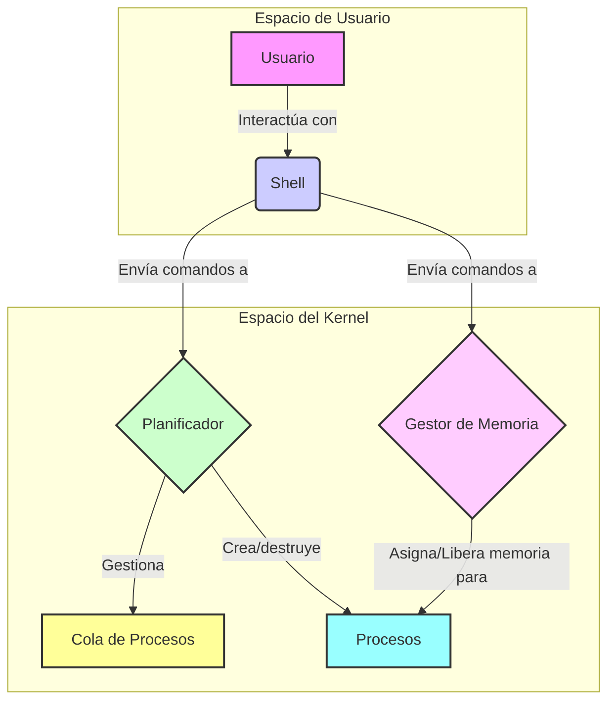

# Terminal-OPPS: Un Simulador Simple de Sistema Operativo

Bienvenido a Terminal-OPPS, un simulador ligero basado en terminal para conceptos centrales de sistemas operativos, escrito en Python. Este proyecto proporciona un entorno práctico para comprender la planificación de procesos, la gestión de memoria y el ciclo de vida de los procesos.

## ✨ Características

-   **Shell Interactivo:** Una interfaz de línea de comandos simple para interactuar con los componentes del SO.
-   **Gestión de Procesos:** Crea, lista y termina procesos simulados.
-   **Planificación Round-Robin:** Un planificador apropiativo que ejecuta procesos en una cola circular con un cuanto de tiempo fijo.
-   **Gestión de Memoria First-Fit:** Un gestor de memoria que asigna el primer bloque de memoria disponible que sea lo suficientemente grande.
-   **Visualización de Memoria:** Observa el estado actual de la memoria, incluidos los bloques asignados y libres.

## 🏗️ Arquitectura

El simulador se compone de cuatro componentes principales que trabajan juntos para imitar el comportamiento de un sistema operativo básico. El shell actúa como la interfaz de usuario, una puerta de entrada a las funcionalidades que ofrecen el planificador y el gestor de memoria.



## 🧩 Componentes

### 1. Shell (`shell.py`)

El punto de entrada para la interacción del usuario. Es un REPL (Read-Eval-Print Loop) que analiza los comandos del usuario y llama a las funciones apropiadas en el planificador y el gestor de memoria.

### 2. Planificador (`scheduler.py`)

Implementa un algoritmo de planificación **Round-Robin**. Mantiene una cola de procesos y los ejecuta durante un cuanto de tiempo determinado.

-   **Algoritmo:** Round-Robin
-   **Quantum:** 2 unidades de tiempo (configurable)

### 3. Gestor de Memoria (`memory.py`)

Administra un espacio de memoria simulado. Utiliza el algoritmo **First-Fit** para manejar las solicitudes de asignación de memoria.

-   **Algoritmo:** First-Fit
-   **Memoria Total:** 100 unidades (configurable)

### 4. Proceso (`process.py`)

Una clase de datos simple que representa un proceso con los siguientes atributos:

-   `pid`: ID del proceso
-   `cpu_units`: Tiempo de CPU requerido para completarse.
-   `mem_req`: Requisito de memoria.
-   `state`: Estado actual (`READY`, `RUNNING`, `FINISHED`).
-   `addr`: La dirección de inicio de la memoria asignada.

## 🚀 Cómo Empezar

### Prerrequisitos

-   Python 3.x

### Instalación y Ejecución

1.  **Clona el repositorio (si aún no lo has hecho):**
    ```bash
    git clone <url-del-repositorio>
    cd Terminal-OPPS-
    ```

2.  **Configura un entorno virtual (recomendado):**
    ```bash
    python3 -m venv venv
    source venv/bin/activate
    ```

3.  **Ejecuta el simulador:**
    ```bash
    python src/main.py
    ```

Serás recibido por el shell del simulador. Escribe `help` para ver la lista de comandos disponibles.

## 💻 Comandos

El shell proporciona los siguientes comandos para interactuar con el simulador:

| Comando                               | Descripción                                               |
| ------------------------------------- | --------------------------------------------------------- |
| `newproc <pid> <cpu_units> <mem_req>` | Crea un nuevo proceso.                                    |
| `ps`                                  | Lista todos los procesos con su estado actual.            |
| `kill <pid>`                          | Termina un proceso y libera su memoria.                   |
| `alloc <pid> <size>`                  | Asigna un bloque de memoria para un proceso determinado.  |
| `free <pid>`                          | Libera la memoria asignada a un proceso.                  |
| `memmap`                              | Muestra el mapa de memoria actual (asignaciones y huecos).|
| `run`                                 | Inicia el planificador para ejecutar los procesos.        |
| `demo`                                | Ejecuta un escenario de demostración preconfigurado.      |
| `help`                                | Muestra el mensaje de ayuda con todos los comandos.       |
| `exit`                                | Sale del shell del simulador.                             |

## 💡 Ejemplo de Uso

Aquí hay un recorrido rápido de una sesión de simulación:

1.  **Inicia el simulador:**
    ```bash
    python src/main.py
    ```

2.  **Crea algunos procesos:**
    ```
    > newproc P1 5 20
    Proceso P1 creado (cpu=5, mem=20)
    > newproc P2 3 30
    Proceso P2 creado (cpu=3, mem=30)
    ```

3.  **Verifica la lista de procesos:**
    ```
    > ps
    {'pid': 'P1', 'cpu_units': 5, 'state': 'READY', 'mem_req': 20, 'addr': 0}
    {'pid': 'P2', 'cpu_units': 3, 'state': 'READY', 'mem_req': 30, 'addr': 20}
    ```

4.  **Visualiza el mapa de memoria:**
    ```
    > memmap
    TOTAL: 100
    FREE: [(50, 50)]
    ALLOC: [('P1', 0, 20), ('P2', 20, 30)]
    ```

5.  **Ejecuta el planificador:**
    ```
    > run
    [t=1] Ejecutando P1 (restan 4)
    [t=2] Ejecutando P1 (restan 3)
    [t=3] Ejecutando P2 (restan 2)
    [t=4] Ejecutando P2 (restan 1)
    [t=5] Ejecutando P1 (restan 2)
    [t=6] Ejecutando P1 (restan 1)
    [t=7] Ejecutando P2 (restan 0)
    [t=7] Proceso P2 ha terminado.
    [t=8] Ejecutando P1 (restan 0)
    [t=8] Proceso P1 ha terminado.
    [scheduler] Todos los procesos finalizaron.
    Timeline: [(1, 'P1'), (2, 'P1'), (3, 'P2'), (4, 'P2'), (5, 'P1'), (6, 'P1'), (7, 'P2'), (8, 'P1')]
    ```