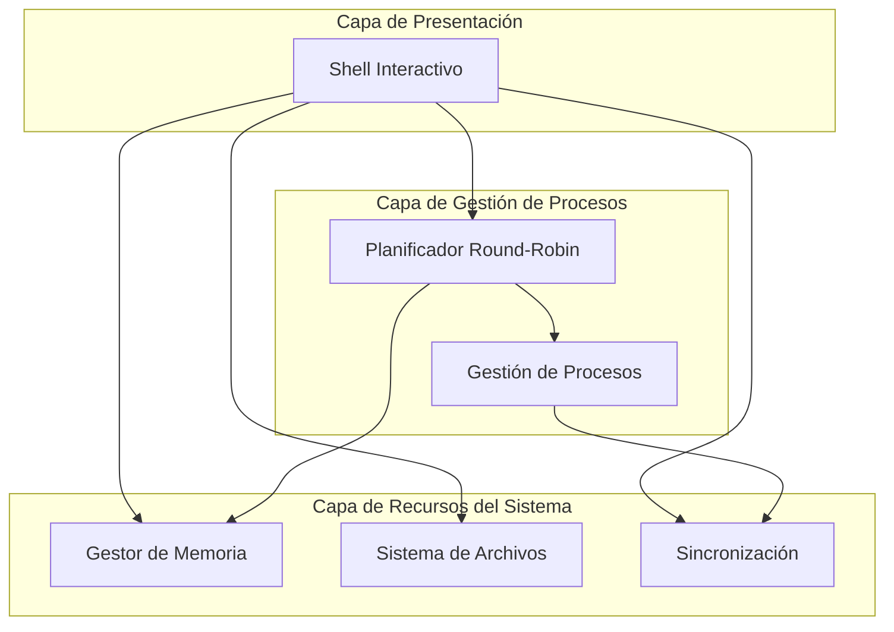
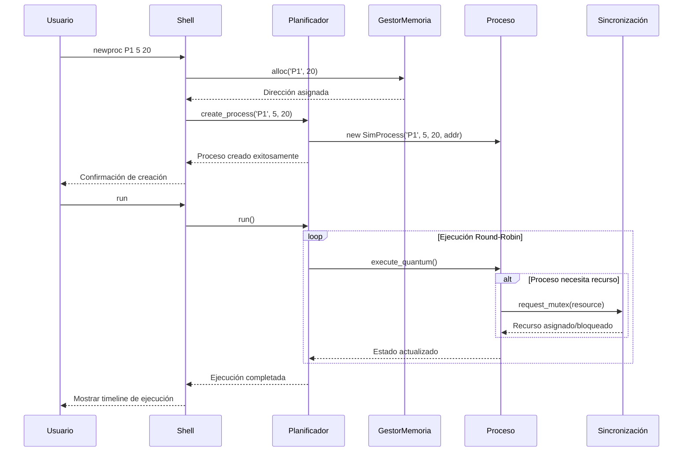
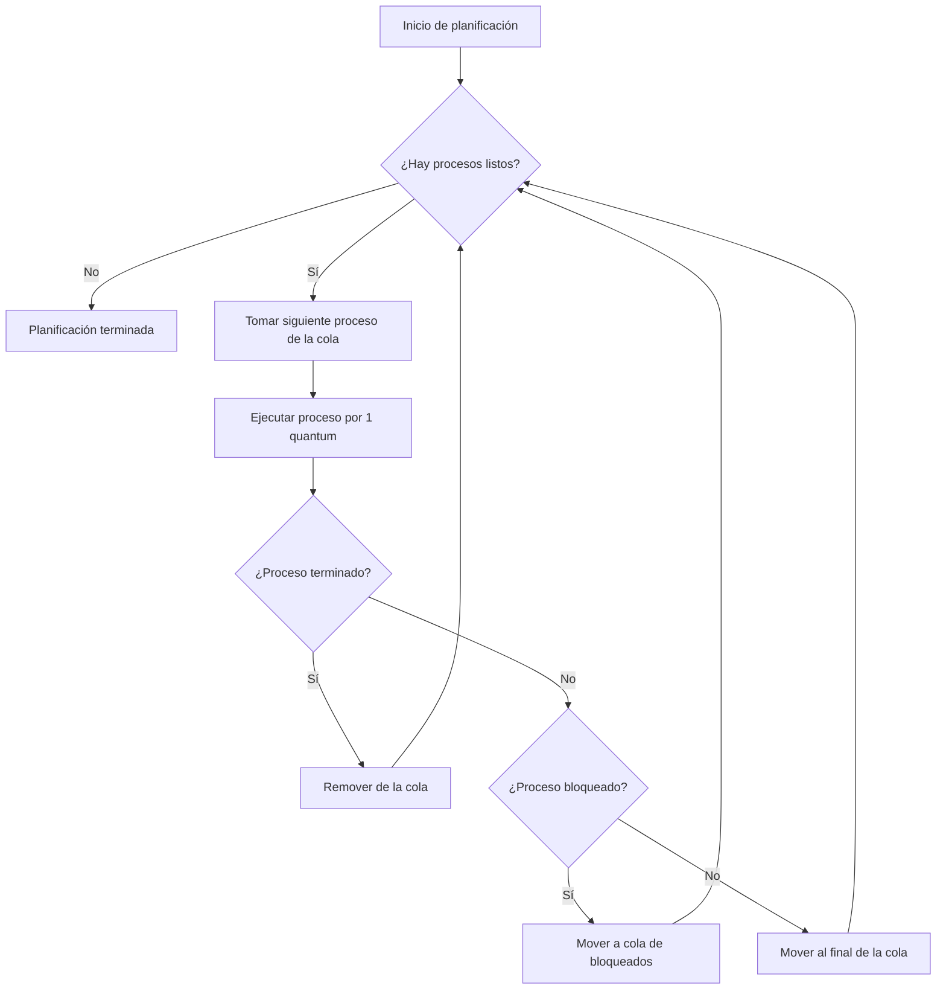
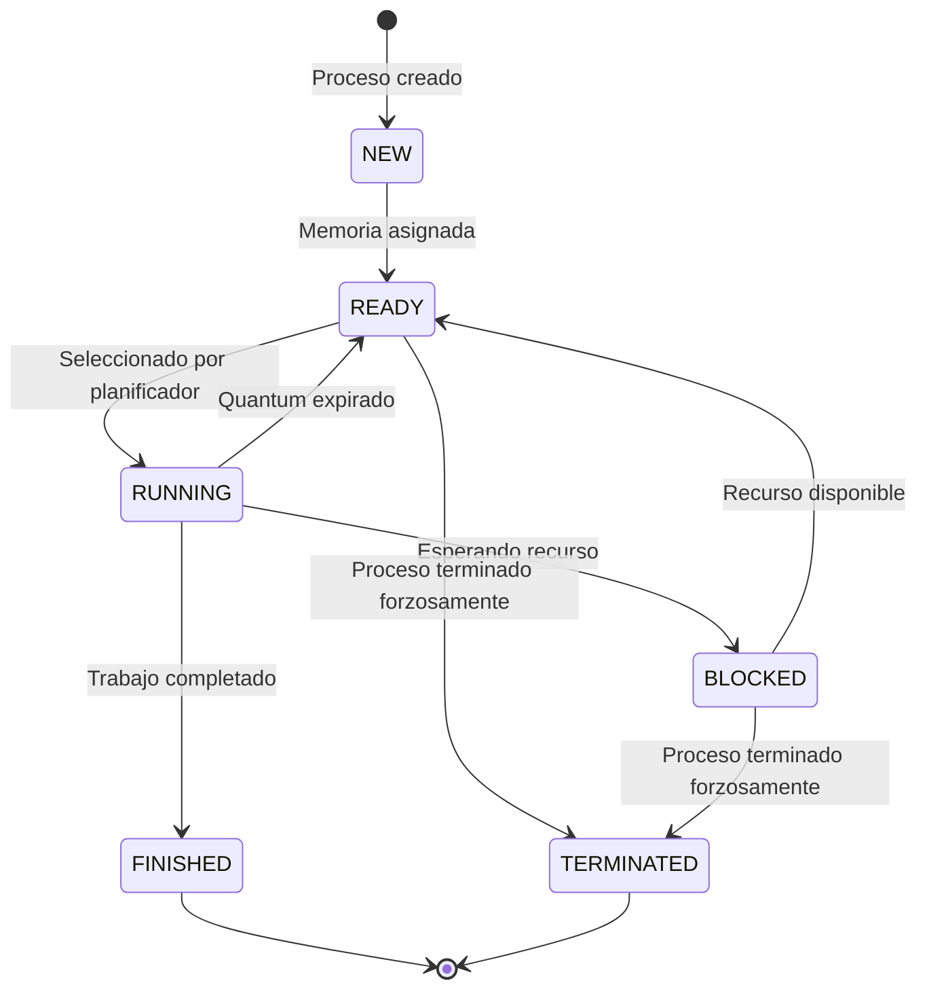
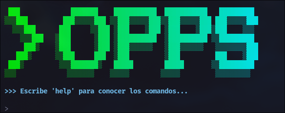
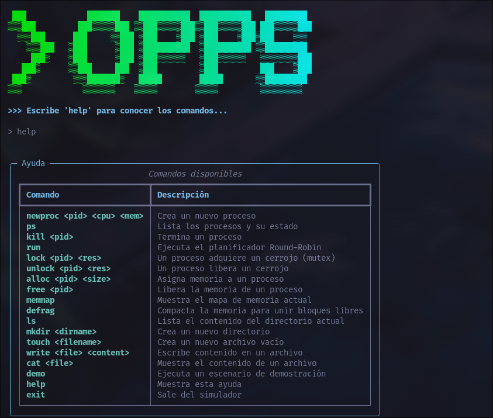

# Terminal-OPPS: Simulador de Sistema Operativo

Terminal-OPPS es un simulador ligero basado en terminal para conceptos centrales de sistemas operativos, desarrollado en Python. Este proyecto proporciona un entorno práctico e interactivo para comprender y experimentar con la planificación de procesos, gestión de memoria, sincronización y sistemas de archivos.

## Tabla de Contenidos

- [Características principales](#características-principales)
- [Estructura del proyecto](#estructura-del-proyecto)
- [Conceptos teóricos implementados](#conceptos-teóricos-implementados)
- [Arquitectura del sistema](#arquitectura-del-sistema)
- [Componentes del simulador](#componentes-del-simulador)
- [Instalación y configuración](#instalación-y-configuración)
- [Manual de comandos](#manual-de-comandos)
- [Ejemplos de uso](#ejemplos-de-uso)
- [Escenarios de demostración](#escenarios-de-demostración)

## Características principales

- **Shell interactivo completo**: Interfaz de línea de comandos intuitiva para interactuar con todos los componentes del sistema operativo
- **Gestión avanzada de procesos**: Creación, monitoreo y terminación de procesos simulados con estados bien definidos
- **Planificador Round-Robin**: Algoritmo de planificación apropiativo con quantum de tiempo configurable
- **Gestor de memoria First-Fit**: Sistema de gestión de memoria con soporte para asignación, liberación y defragmentación
- **Sincronización robusta**: Implementación de mutex para protección de recursos críticos y prevención de condiciones de carrera
- **Sistema de archivos completo**: Sistema de archivos jerárquico basado en inodos con persistencia en JSON
- **Visualización de estados**: Herramientas para visualizar el estado de la memoria, procesos y sistema de archivos

## Estructura del proyecto

```
Terminal-OPPS/
├── src/                          # Código fuente principal
│   ├── main.py                   # Punto de entrada del simulador
│   ├── shell.py                  # Shell interactivo (REPL)
│   ├── process.py                # Clase SimProcess (PCB)
│   ├── scheduler.py              # Planificador Round-Robin
│   ├── memory.py                 # Gestor de memoria First-Fit
│   ├── filesystem.py             # Sistema de archivos basado en inodos
│   ├── synchronization.py        # Primitivas de sincronización
│   └── __pycache__/              # Archivos compilados de Python
├── docs/                         # Documentación del proyecto
│   └── requerimientos.md         # Especificaciones y requerimientos
├── assets/                       # Recursos gráficos
│   ├── image-1.png              # Captura del simulador en funcionamiento
│   └── image-2.png              # Captura del menú de ayuda
├── venv/                         # Entorno virtual de Python (generado)
├── fs_state.json                 # Estado persistente del sistema de archivos
└── README.md                     # Documentación principal
```

## Conceptos teóricos implementados

### Planificación de procesos (Round-Robin)

Algoritmo de planificación apropiativo donde cada proceso recibe una porción equitativa de tiempo de CPU llamada quantum. Las características principales incluyen:

- **Equidad**: Todos los procesos reciben la misma cantidad de tiempo de CPU
- **Prevención de inanición**: Ningún proceso puede monopolizar la CPU indefinidamente
- **Simplicidad**: Implementación directa usando una cola circular
- **Previsibilidad**: Tiempo de respuesta predecible para procesos interactivos

### Gestión de memoria (First-Fit)

Sistema de asignación de memoria contigua que optimiza la velocidad de asignación:

- **Algoritmo rápido**: Selecciona el primer bloque libre que satisfaga el requerimiento
- **Gestión de fragmentación**: Implementa defragmentación para compactar memoria libre
- **Seguimiento preciso**: Mantiene registro detallado de bloques asignados y libres
- **Visualización clara**: Proporciona mapas visuales del estado de la memoria

### Sincronización (Mutex)

Primitiva de exclusión mutua para proteger recursos críticos:

- **Exclusión mutua garantizada**: Solo un proceso puede acceder al recurso protegido
- **Prevención de condiciones de carrera**: Evita inconsistencias en datos compartidos
- **Gestión de bloqueos**: Manejo de procesos bloqueados esperando recursos
- **Detección de deadlock**: Identificación básica de situaciones de bloqueo mutuo

### Sistema de archivos (Basado en inodos)

Estructura jerárquica para organización y almacenamiento de datos:

- **Estructura de árbol**: Directorios y archivos organizados jerárquicamente
- **Metadatos completos**: Información detallada sobre cada archivo y directorio
- **Persistencia**: Estado del sistema guardado en formato JSON
- **Operaciones CRUD**: Creación, lectura, actualización y eliminación de archivos

## Arquitectura del sistema

El simulador sigue una arquitectura modular donde cada componente tiene responsabilidades específicas y bien definidas:



### Flujo de ejecución de comandos

El siguiente diagrama muestra la interacción entre componentes durante la creación y ejecución de un proceso:



## Componentes del simulador

### Shell (shell.py)

**Funcionalidad**: Interfaz de usuario basada en texto que implementa un bucle REPL (Read-Eval-Print Loop).

**Características principales**:
- Análisis y validación de comandos de entrada
- Manejo de errores con mensajes informativos
- Autocompletado básico y historial de comandos
- Integración seamless con todos los subsistemas

**Comandos soportados**: Más de 15 comandos organizados en categorías funcionales

### Planificador (scheduler.py)

**Funcionalidad**: Implementa el algoritmo de planificación Round-Robin para la gestión temporal de procesos.

**Parámetros configurables**:
- **Quantum**: 2 unidades de tiempo (modificable)
- **Cola de procesos**: Estructura FIFO con rotación automática

**Algoritmo de planificación**:



### Gestor de memoria (memory.py)

**Funcionalidad**: Administra un espacio de memoria simulado usando el algoritmo First-Fit.

**Configuración**:
- **Tamaño total**: 100 unidades (configurable)
- **Unidad mínima**: 1 unidad de memoria
- **Algoritmo**: First-Fit con defragmentación opcional

**Estados de la memoria**:

```mermaid
gantt
    title Ejemplo de gestión de memoria
    dateFormat X
    axisFormat %s

    section Estado inicial
    Memoria libre: 0, 100

    section Después de alloc(P1, 30)
    P1: 0, 30
    Libre: 30, 70

    section Después de alloc(P2, 40)
    P1: 0, 30
    P2: 30, 40
    Libre: 70, 30

    section Después de free(P1)
    Libre (fragmento): 0, 30
    P2: 30, 40
    Libre: 70, 30

    section Después de defragmentación
    P2: 0, 40
    Libre (compactado): 40, 60
```



### Gestión de procesos (process.py)

**Funcionalidad**: Define la estructura y comportamiento de los procesos simulados.

**Atributos del proceso**:
- `pid`: Identificador único del proceso
- `cpu_units`: Tiempo de CPU requerido para completarse
- `mem_req`: Cantidad de memoria necesaria
- `state`: Estado actual del proceso
- `addr`: Dirección base en memoria
- `allocated_mem`: Memoria efectivamente asignada

**Estados del proceso**:



### Sincronización (synchronization.py)

**Funcionalidad**: Proporciona mecanismos de exclusión mutua para proteger recursos críticos.

**Componentes principales**:
- **Mutex**: Cerrojo binario para exclusión mutua
- **LockManager**: Gestor central de todos los cerrojos del sistema
- **Cola de espera**: Procesos bloqueados esperando recursos

**Casos de uso**:
- Protección de archivos durante escritura
- Sincronización de acceso a memoria compartida
- Coordinación entre procesos concurrentes

## Instalación y configuración

### Prerrequisitos

- Python 3.8 o superior
- Sistema operativo: Windows, macOS, o Linux
- Terminal con soporte para colores (recomendado)

### Pasos de instalación

1. **Clonar el repositorio**:
   ```bash
   git clone <url-del-repositorio>
   cd Terminal-OPPS
   ```

2. **Crear entorno virtual**:
   ```bash
   python3 -m venv venv

   # En Linux/macOS
   source venv/bin/activate

   # En Windows
   venv\Scripts\activate
   ```

3. **Verificar la instalación**:
   ```bash
   python --version
   # Debe mostrar Python 3.8 o superior
   ```

4. **Ejecutar el simulador**:
   ```bash
   python src/main.py
   ```

### Configuración inicial

Al ejecutar por primera vez, el simulador:
- Inicializa el sistema de archivos con un directorio raíz
- Configura el gestor de memoria con 100 unidades
- Establece el quantum del planificador en 2 unidades
- Crea el archivo `fs_state.json` para persistencia

## Manual de comandos

### Gestión de procesos

| Comando | Sintaxis | Descripción | Ejemplo |
|---------|----------|-------------|---------|
| `newproc` | `newproc <pid> <cpu> <mem>` | Crea un nuevo proceso con ID, tiempo CPU y memoria especificados | `newproc P1 5 20` |
| `ps` | `ps` | Lista todos los procesos con su estado actual | `ps` |
| `kill` | `kill <pid>` | Termina forzosamente un proceso específico | `kill P1` |
| `run` | `run` | Ejecuta el planificador hasta que todos los procesos terminen | `run` |

### Gestión de memoria

| Comando | Sintaxis | Descripción | Ejemplo |
|---------|----------|-------------|---------|
| `alloc` | `alloc <pid> <size>` | Asigna memoria a un proceso | `alloc P1 30` |
| `free` | `free <pid>` | Libera la memoria de un proceso | `free P1` |
| `memmap` | `memmap` | Muestra el mapa visual de la memoria | `memmap` |
| `defrag` | `defrag` | Compacta la memoria eliminando fragmentación | `defrag` |

### Sincronización

| Comando | Sintaxis | Descripción | Ejemplo |
|---------|----------|-------------|---------|
| `lock` | `lock <pid> <resource>` | Proceso adquiere un mutex para un recurso | `lock P1 file_lock` |
| `unlock` | `unlock <pid> <resource>` | Proceso libera un mutex | `unlock P1 file_lock` |

### Sistema de archivos

| Comando | Sintaxis | Descripción | Ejemplo |
|---------|----------|-------------|---------|
| `ls` | `ls [directorio]` | Lista contenido del directorio actual o especificado | `ls /home` |
| `mkdir` | `mkdir <nombre>` | Crea un nuevo directorio | `mkdir documentos` |
| `touch` | `touch <archivo>` | Crea un archivo vacío | `touch archivo.txt` |
| `write` | `write <archivo> <contenido>` | Escribe contenido en un archivo | `write log.txt "Mensaje"` |
| `cat` | `cat <archivo>` | Muestra el contenido de un archivo | `cat archivo.txt` |
| `cd` | `cd <directorio>` | Cambia al directorio especificado | `cd /home/user` |
| `pwd` | `pwd` | Muestra el directorio de trabajo actual | `pwd` |

### Comandos generales

| Comando | Sintaxis | Descripción | Ejemplo |
|---------|----------|-------------|---------|
| `demo` | `demo` | Ejecuta una demostración completa del sistema | `demo` |
| `help` | `help` | Muestra la ayuda completa de comandos | `help` |
| `clear` | `clear` | Limpia la pantalla del terminal | `clear` |
| `exit` | `exit` | Sale del simulador | `exit` |

## Ejemplos de uso

### Ejemplo básico: Gestión de procesos

```bash
# Crear tres procesos con diferentes requerimientos
Terminal-OPPS> newproc P1 3 15
Terminal-OPPS> newproc P2 4 25
Terminal-OPPS> newproc P3 2 10

# Ver el estado de todos los procesos
Terminal-OPPS> ps

# Ejecutar el planificador
Terminal-OPPS> run

# Ver el mapa de memoria después de la ejecución
Terminal-OPPS> memmap
```

### Ejemplo intermedio: Sincronización

```bash
# Crear dos procesos que competirán por un recurso
Terminal-OPPS> newproc Writer1 3 10
Terminal-OPPS> newproc Writer2 3 10

# Writer1 adquiere el cerrojo para un archivo crítico
Terminal-OPPS> lock Writer1 critical_file

# Writer2 intenta adquirir el mismo cerrojo (se bloquea)
Terminal-OPPS> lock Writer2 critical_file

# Verificar estados - Writer2 debe estar BLOCKED
Terminal-OPPS> ps

# Writer1 libera el cerrojo
Terminal-OPPS> unlock Writer1 critical_file

# Writer2 ahora puede proceder
Terminal-OPPS> ps
```

### Ejemplo avanzado: Sistema de archivos

```bash
# Crear estructura de directorios
Terminal-OPPS> mkdir proyectos
Terminal-OPPS> cd proyectos
Terminal-OPPS> mkdir sistema_operativo
Terminal-OPPS> cd sistema_operativo

# Crear y escribir archivos
Terminal-OPPS> touch notas.txt
Terminal-OPPS> write notas.txt "Implementación de Round-Robin completada"
Terminal-OPPS> touch tareas.txt
Terminal-OPPS> write tareas.txt "Pendiente: mejorar visualización de memoria"

# Listar y ver contenido
Terminal-OPPS> ls
Terminal-OPPS> cat notas.txt
Terminal-OPPS> cat tareas.txt
```

## Escenarios de demostración

### Demostración completa del sistema

El comando `demo` ejecuta un escenario que ilustra todas las funcionalidades:

1. **Inicialización del sistema**
2. **Creación de procesos con diferentes prioridades**
3. **Asignación y liberación de memoria**
4. **Uso de sincronización para proteger recursos**
5. **Operaciones del sistema de archivos**
6. **Ejecución del planificador con visualización**

### Escenario de condición de carrera

Este escenario demuestra cómo los mutex previenen condiciones de carrera:

```bash
# Configuración inicial
Terminal-OPPS> touch log_compartido.txt
Terminal-OPPS> newproc Logger1 4 15
Terminal-OPPS> newproc Logger2 4 15

# Sin sincronización (problemático)
Terminal-OPPS> write log_compartido.txt "Entrada de Logger1"
Terminal-OPPS> write log_compartido.txt "Entrada de Logger2"
# El segundo write sobrescribe el primero

# Con sincronización (correcto)
Terminal-OPPS> lock Logger1 log_mutex
Terminal-OPPS> write log_compartido.txt "Entrada segura de Logger1"
Terminal-OPPS> unlock Logger1 log_mutex

Terminal-OPPS> lock Logger2 log_mutex
Terminal-OPPS> write log_compartido.txt "Entrada segura de Logger2"
Terminal-OPPS> unlock Logger2 log_mutex

Terminal-OPPS> cat log_compartido.txt
# Muestra la última entrada, pero el acceso fue serializado
```

### Escenario de fragmentación de memoria

Demuestra el problema de fragmentación y su solución:

```bash
# Crear fragmentación
Terminal-OPPS> newproc A 1 20
Terminal-OPPS> newproc B 1 30
Terminal-OPPS> newproc C 1 15
Terminal-OPPS> memmap

# Liberar proceso B (crea hueco en el medio)
Terminal-OPPS> kill B
Terminal-OPPS> free B
Terminal-OPPS> memmap

# Intentar asignar proceso grande
Terminal-OPPS> newproc D 1 40
# Fallará por fragmentación

# Defragmentar y reintentar
Terminal-OPPS> defrag
Terminal-OPPS> memmap
Terminal-OPPS> newproc D 1 40
# Ahora funciona
```

## Capturas de pantalla

### Terminal principal

*Interfaz principal del simulador mostrando la ejecución de comandos*

### Menú de ayuda

*Menú de ayuda mostrando todos los comandos disponibles organizados por categorías*

---

**Terminal-OPPS** - Un simulador educativo para el aprendizaje de sistemas operativos desarrollado como proyecto académico. Ideal para estudiantes y educadores que buscan una herramienta práctica e interactiva para comprender los conceptos fundamentales de los sistemas operativos modernos.
